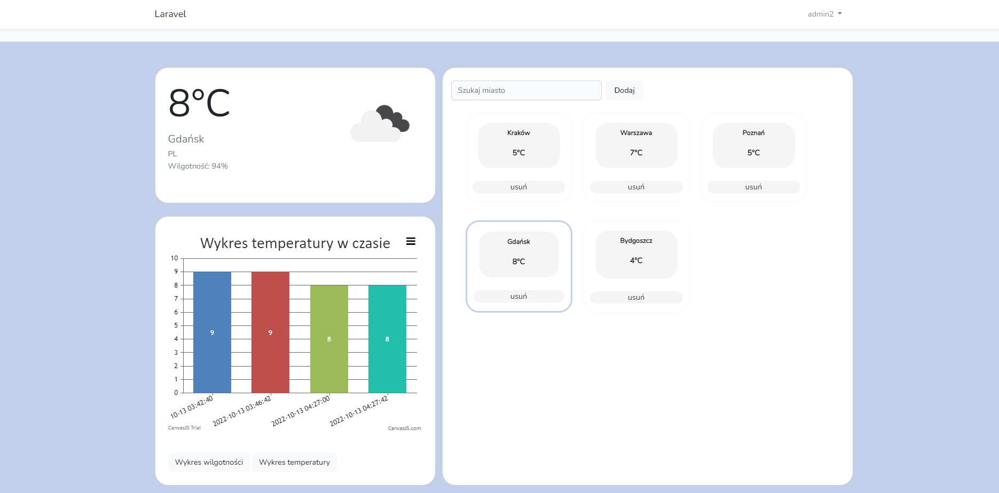

# Aplikacja pogodowa

Aplikacja umożliwia zalogowanemu użytkownikowi dodawanie miast do listy, a następnie śledzenie aktualnej temperatury. 
Dodatkowo każdy użytkownik ma wgląd do historycznych danych wybranego miasta tj. wykres temperatury lub wilgotności w czasie.
Aplikacja automatycznie aktualizuje dane pogodowe co 30min.

## Przykładowe dane do logowania
admin:
```bash
  Email: admin@email.com
  Hasło: adminadmin
```
admin2:
```bash
  Email: admin2@email.com
  Hasło: adminadmin2
```
### Komenda do wywołania aktualizacji pogody
```angular2html
php artisan getWeather:current
```


## Screenshots

Widok zalogowanego użytkownika z ulubionymi miastami:


